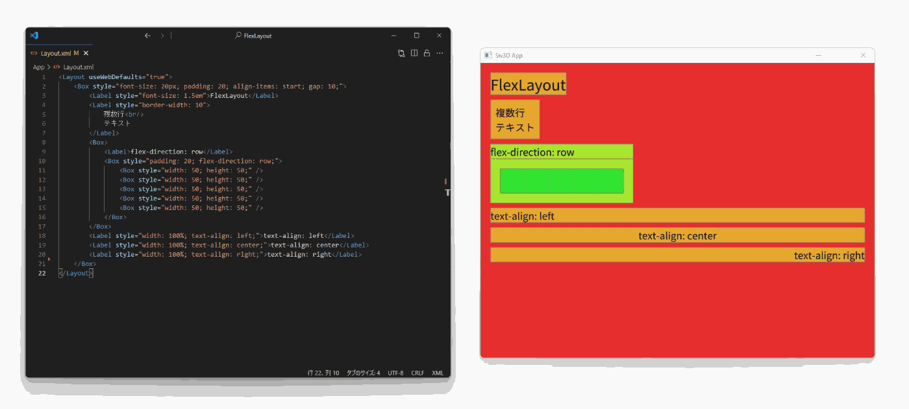

# FlexLayout



OpenSiv3Dで[フレックスボックス](https://developer.mozilla.org/ja/docs/Learn/CSS/CSS_layout/Flexbox)を使ったUIレイアウトができるライブラリです

## 使い方

### レイアウトファイル

`<Box>`：ボックスレイアウトに対応したコンテナー   
`<Label>`：テキストを描画できる要素 (改行は`<br/>`を使用)

属性：

- `id`：文書全体で一意のID
- `class`：要素のクラス
- `style`：[インラインCSS](#インラインCSS)

> **記述例：**
> ```xml
> <Layout useWebDefaults="true">
> 	<Box id="root">
>             <Label class="label">Hello, World!</Label>
> 	</Box>
> </Layout>
> ```

### C++クラス `FlexLayout::FlexLayout`

#### コンストラクタ

- `FlexLayout{ U"hoge/レイアウトファイル.xml", FlexLayout::EnableHotReload::No }`
  - レイアウトファイルのファイルパスを指定して初期化
  - 第２引数をFlexLayout::EnableHotReload::Yesにすると、ファイルの保存時にレイアウトファイルを自動で再読み込みします

- `FlexLayout{ Arg::code=U"<Layout>...</Layout>" }`
  - レイアウトのXMLを直接指定して初期化

#### メンバ関数

- `load()`

  レイアウトを読み込む
  読み込みに失敗した場合はfalseを返しますが、現在のレイアウトには影響しません

- `reload()`

  ファイルを再読み込み (ファイルパスを指定した場合のみ使用可)

- `getElementsByClassName(class)`

  クラス名から要素を検索

- `getElementById(id)`

  IDから要素を１つだけ取得
  ここで取得した要素は、reloadなどで再読み込みしても参照が保持されます

- `update()`

  ホットリロード、レイアウトの更新を実行
  引数にはレイアウトで使用する横幅、縦幅を設定できます

> **実装例：**
>
> ```cpp
> #include <Siv3D.hpp>
> #include "FlexLayout/FlexLayout.hpp"
> 
> void Main()
> {
> 	FlexLayout::FlexLayout layout{ U"Layout.xml" };
> 	
> 	while(System::Update())
> 	{
> 		layout.update(Scene::Rect());
> 	}
> }
> ```

## インラインCSS

BoxとLabelはインラインCSSによるスタイル設定に対応しています

各プロパティの詳細については[MDN Web Docs](https://developer.mozilla.org/ja/docs/Web/CSS)などを参照してください

### 対応プロパティ

- レイアウト関連 (https://www.yogalayout.dev/docs/styling/)
  - `align-content`
  - `align-items`
  - `aspect-ratio`
  - `display`
  - `flex` (`flex-basis`,`flex-grow`,`flex-shrink`)
  - `flex-direction`
  - `flex-wrap`
  - `gap` (`row-gap`,`column-gap`)
  - `position`
  - `top`,`right`,`bottom`,`left`
  - `justify-content`
  - `direction`
  - `margin` (`margin-top`,`margin-right`,`margin-bottom`,`margin-left`)
  - `padding` (`padding-top`,`padding-right`,`padding-bottom`,`padding-left`)
  - `border-width` (`border-top-width`,`border-right-width`,`border-bottom-width`, `border-left-width`)
  - `width` (`min-width`, `min-height`)
  - `height` (`max-width`, `max-height`)
- ラベル関連
  - `font-size`
    - px, %, em, rem(1rem=16pxとして計算)
  - `line-height`
    - 実数倍率のみ対応
  - `text-align`
    - inherit, left, center, right
  - `-siv3d-font`
    - 描画に使用するFontAssetのアセット名 (デフォルトは`SimpleGUI::GetFont()`)

## 動作環境

- OpenSiv3D 0.6.15
- vcpkg
