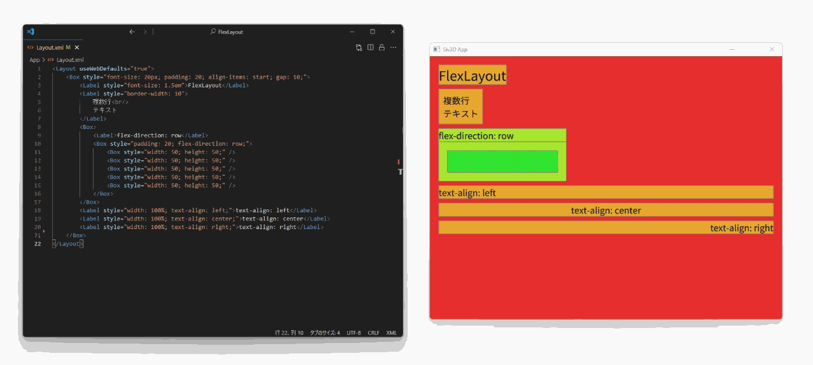

# FlexLayout



OpenSiv3Dで[フレックスボックス](https://developer.mozilla.org/ja/docs/Learn/CSS/CSS_layout/Flexbox)を使ったUIレイアウトができるライブラリです

## 導入方法

> [!NOTE]
> 現在Windows版Siv3Dのみ対応しています (Mac,Linux,Webは今後対応予定)

> [!IMPORTANT]
> OpenSiv3D v0.6.15以外のバージョンでは正しく動作しない可能性があります

1. [Windows版 OpenSiv3D SDK v0.6.15](https://siv3d.github.io/ja-jp/download/windows/)をインストールする

2. FlexLayoutの最新版zipファイルをダウンロード

4. OpenSiv3D SDKのフォルダを開き、ダウンロードした.zipファイルの中身をコピーする

    > **SDKのフォルダを簡単に開く方法**    
    > `Win`+`R`キーを押し、以下のコマンドを実行してください：
    > ```
    > explorer.exe %SIV3D_0_6_15%
    > ```
    
    https://github.com/user-attachments/assets/332176ee-b63c-4221-b9b2-30aa3a1da5bc

6. Visual Studioで通常通りOpenSiv3Dのプロジェクトを作成する

7. `Main.cpp`などの先頭に、`FlexLayout.hpp`をインクルードする

   ```diff
     #include <Siv3D.hpp>
   + #include <FlexLayout.hpp>

     ...
   ```

## 使い方

実装例は[サンプルコード](Example/)もご覧ください

### レイアウトファイル (XML)

`<Layout>`：レイアウトファイルの宣言    
`<Box>`：ボックスレイアウトに対応したコンテナー   
`<Label>`：テキストを描画できる要素 (改行には`<br/>`を使用)

属性：

- `id`：文書全体で一意のID
- `class`：要素のクラス
- `style`：[インラインCSS](#インラインCSS)

> **記述例：**
> ```xml
> <Layout>
> 	<Box id="root">
> 		<Label class="label">Hello, World!</Label>
> 	</Box>
> </Layout>
> ```

### `FlexLayout::Layout`

#### コンストラクタ

- `Layout{ U"hoge/レイアウトファイル.xml", FlexLayout::EnableHotReload::No }`
  - レイアウトファイルのファイルパスを指定して初期化
  - 第２引数をFlexLayout::EnableHotReload::Yesにすると、ファイルの保存時にレイアウトファイルを自動で再読み込みします

- `Layout{ Arg::code=U"<Layout>...</Layout>" }`
  - レイアウトのXMLを直接指定して初期化

#### メンバ関数

- `load()`

  レイアウトを読み込む   
  読み込みに失敗した場合はfalseを返しますが、現在のレイアウトには影響しません

- `reload()`

  ファイルを再読み込み (ファイルパスを指定した場合のみ使用可)

- `update()`

  ホットリロード、レイアウトの更新を実行   
  引数にはレイアウトで使用する横幅、縦幅を設定できます

- `document()`

  ルート要素を取得します (`FlexLayout::Box`)

> **実装例：**
>
> ```cpp
> #include <Siv3D.hpp>
> #include "FlexLayout/Layout.hpp"
> 
> void Main()
> {
> 	FlexLayout::Layout layout{ U"Layout.xml" };
> 	
> 	while(System::Update())
> 	{
> 		layout.update(Scene::Rect());
> 		auto root = layout.document();
> 	}
> }
> ```

### `FlexLayout::Box` (`FlexLayout::Label`でも同様)

#### メンバ関数

- `getElementsByClassName(class)`

  クラス名から要素を検索

- `getElementById(id)`

  IDから要素を１つだけ取得   
  ここで取得した要素は、reloadなどで再読み込みしても参照が保持されます

- `marginAreaRect()`, `borderAreaRect()`, `paddingAreaRect()`, `contentAreaRect()`

  ボックスモデルの各領域を取得   
  参照：[CSS 基本ボックスモデル入門](https://developer.mozilla.org/ja/docs/Web/CSS/CSS_box_model/Introduction_to_the_CSS_box_model)

- `getStyle(U"property")`

  要素のスタイルを取得   
  値が設定されていない場合、空の配列を返します

- `setStyle(U"property", ...)`

  要素のスタイルを設定

- `asLabel()`

  `FlexLayout::Label`のインスタンスを取得 (`<Label/>`で宣言されていた時のみ有効)

### `FlexLayout::Label`

#### メンバ関数

- `draw(...)`

  ラベルの文字列を描画

- `text()`, `setText(text)`

  ラベルの文字列を取得,更新   
  (描画に反映させるには`FlexLayout::Layout::update()`の呼び出しが必要です)

## インラインCSS

BoxとLabelはインラインCSSによるスタイル設定に対応しています

各プロパティの詳細については[MDN Web Docs](https://developer.mozilla.org/ja/docs/Web/CSS)などを参照してください

### 対応プロパティ

- レイアウト関連
  - align*
    - `align-content`
    - `align-items`
    - `align-self`
  - `aspect-ratio`
  - `display`
  - flex*
    - `flex` (`flex-basis`,`flex-grow`,`flex-shrink`)
    - `flex-flow` (`flex-direction`,`flex-wrap`)
  - `gap` (`row-gap`,`column-gap`)
  - `position`
  - `top`,`right`,`bottom`,`left`
  - `justify-content`
  - `direction`
  - `margin` (`margin-top`,`margin-right`,`margin-bottom`,`margin-left`)
  - `padding` (`padding-top`,`padding-right`,`padding-bottom`,`padding-left`)
  - `border-width` (`border-top-width`,`border-right-width`,`border-bottom-width`, `border-left-width`)
  - `width` (`min-width`, `min-height`)
  - `height` (`max-width`, `max-height`)
- ラベル関連
  - `font-size`
  - `line-height`
    - 実数倍率のみ対応
  - `text-align`

### 対応する長さ単位

`pc`, `ch`, `em`, `ex`, `ic`, `lh`

## 動作環境

- プラットフォーム
  - Windows 10/11
- 依存ライブラリ
  - [OpenSiv3D](https://github.com/Siv3D/OpenSiv3D) 0.6.15
  - [yoga](https://github.com/facebook/yoga)
  - [tinyxml2](https://github.com/leethomason/tinyxml2) (OpenSiv3Dと同一バージョン)
- 開発環境
  - MSVC
  - vcpkg
  - Python3
